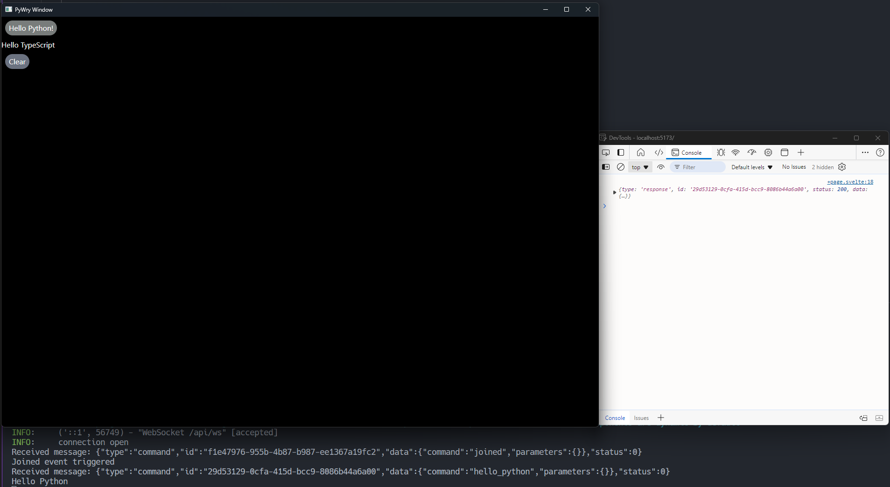
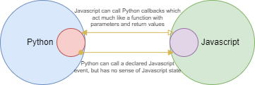
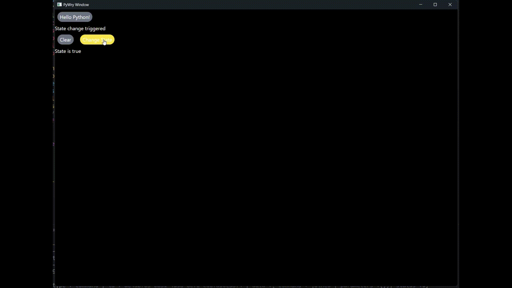

# Pywry Webview

A full example of a webview application with a communication between Python and JavaScript/Typescript. This project demonstrates how to use ~~Pywry~~ Wrypy aswell as how to setup a state management system with websockets and Sveltekit stores.



This implementation with Websockets should allow for bi-directional communication between the Python backend and the frontend. This is useful for real-time applications or applications that require a lot of data to be sent back and forth.



### Update

Due to some limiting factors with Pywry, I have decided to switch to Wrypy. It's a library compiled from Tao, Wry and Pyo3. The team behind Wrypy (including myself) are actively working on this project to make it more stable and feature-rich. The main reason for the switch is that Wrypy is maintained by me and the team, and we can make changes to the library to suit our needs. There were a few changes to the source code, but nothing major. The main change was the switch from Pywry to Wrypy which have different approaches to initializing the webview.

## Demo



## Requirements

- Python 3.12+
- PNPM 8.15+
- Just 1.32+

## Installation

```bash
just install
```

## Usage

```bash
just dev
```

## Build

```bash
just build
```

Things like `test` are WIP.
